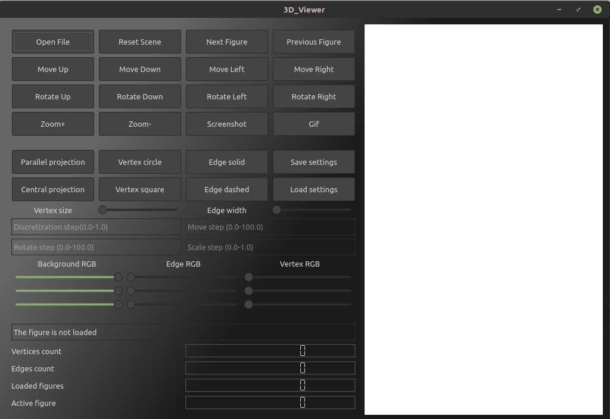

# CPP4_3DViewer_v2.0-2 

 Инструкция по установке и использованию учебного проекта 3DViewer v2.0.
  

  ## Сборка

Команда ___make all___ выполняет несколько целей:
  - тестировавние;
  - создание файла c покрытием тестами;
  - установка;
  - создание архива;
  - запуск приложения;
  - открытие инструкции по работе с проектом.

## Part 1. Реализация 3DViewer v2.0
 
### Part 1 Основное задание
 - Программа разработана на языке C++ стандарта C++17.
 - Код программы должен находиться в папке src.
 - Код выдержан в соответствии с Google Style.
 - Программа разработана в соответствии с принципами объектно-ориентированного программирования.
 - В один момент только одна модель находится на экране.
 - Классы реализованы внутри пространства имен s21.
 - Библиотека, реализующая логику игры, должна покрыта unit-тестам, покрытие выще 80 процентов.
 - Сборка программы настроена с помощью Makefile со стандартным набором целей для GNU-программ: all, install, uninstall, clean, dvi, dist, tests.
 - Программа имеет предоставлять возможность:
   Загружать каркасную модель из файла формата obj (поддержка только списка вершин и поверхностей);
  Перемещать модель на заданное расстояние относительно осей X, Y, Z;
  Поворачивать модель на заданный угол относительно своих осей X, Y, Z;
  Масштабировать модель на заданное значение.
  Реализация с графическим пользовательским интерфейсом, на базе QT.

 - Программа реализована с использованием паттерна MVC, а также.

  Программа должна корректно обрабатывать и позволять пользователю просматривать модели с деталями до 100, 1000, 10 000, 100 000, 1 000 000 вершин без зависания (зависание — это бездействие интерфейса более 0,5 секунды).

### Part 2. Дополнительно. Настройки
- Программа позволяет настраивать тип проекции (параллельная и центральная).
- Программа позволяет настраивать тип (сплошная, пунктирная), цвет и толщину ребер, способ отображения (отсутствует, круг, квадрат), цвет и размер вершин.
 - Программа позволяет выбирать цвет фона.
 - Настройки сохраняются между перезапусками программы.

### Part 3. Дополнительно. Запись
 - Программа позволяет сохранять полученные («отрендеренные») изображения в файл в форматах bmp и jpeg.
 - Программа позволяет по специальной кнопке записывать небольшие «скринкасты» — текущие пользовательские аффинные преобразования загруженного объекта в gif-анимацию (640x480, 10fps, 5s).

  [вверх](#anchor)
